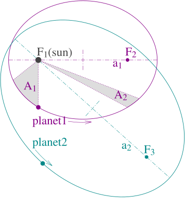

# Orbital Mechanics (Orekit Foundations)

## Overview

Orbital mechanics determines **where** a satellite will be in the sky, **when** it will be visible from a ground station, and **how** its motion affects signal properties (Doppler, visibility window, slant range). Security researchers need to understand orbital mechanics to: correlate RF observations with satellite events, detect spoofed or anomalous telemetry by comparing expected and observed timing/position, plan jamming or anti-jamming analysis responsibly, and interpret predictions produced by software libraries like Orekit or SGP4.

---

## Newton’s laws in orbit dynamics

At the heart of orbital motion are Newton’s laws of motion and universal gravitation:

- **First law (inertia):** a satellite in free space moves in a straight line at constant velocity unless acted upon by a force. In orbit, the dominant force is gravity, which curves that straight-line motion into an orbit.
- **Second law (force = mass × acceleration):** gravity produces acceleration toward the central body (Earth). This acceleration determines how velocity changes over time and thus the shape of the trajectory.
- **Third law (action–reaction):** mutual forces exist between bodies — relevant for multi-body interactions like third-body perturbations (Moon, Sun) but less so for single-satellite single-Earth approximations.

>[!IMPORTANT]
>
>**Why this?** 
>
>orbital motion is the balance of inertia (tendency to travel straight) and gravitational pull (tendency to fall toward the Earth). Small additional forces (atmospheric drag, solar pressure) change the balance slowly, cumulatively altering the orbit in ways that affect long-term predictability.

---

## Kepler’s laws of motion — intuition and implications

Kepler’s laws describe the idealized two-body motion (massless satellite around a massive Earth) and remain foundational for understanding orbits:

- **Orbits are conic sections:** in the simple two-body case, trajectories are ellipses (bound), parabolas, or hyperbolas (escape). Practical satellites around Earth are typically ellipses or near-circles.
- **Equal areas in equal times:** a satellite sweeps equal areas in equal time intervals — this means a satellite moves fastest at perigee (closest approach) and slowest at apogee (farthest point). For security, this affects Doppler rate and visibility speed across the sky.
- **Orbital period relation to semi-major axis:** the time to complete an orbit depends only on the size of the orbit (semi-major axis) in the two-body approximation. Thus LEO satellites with small semi-major axes have short orbital periods (≈90–120 minutes) while GEO satellites have a 24-hour period.

>[!IMPORTANT]
>
>Keplerian intuition is useful for quick reasoning and for building initial TLEs or checking predicted pass timings before using more accurate propagation models that include perturbations.

---

## Orbital elements

Orbital elements are a compact set of parameters that uniquely describe an orbit in the two-body approximation. There are multiple conventions; the most common are the **Classical (Keplerian) Orbital Elements (COEs)**. 

- **Semi-major axis (a):** intuitively, the size of the orbit. For an ellipse, it is half the long axis; larger `a` means longer orbital period.
- **Eccentricity (e):** describes the orbit's shape; `e=0` is circular, `0<e<1` is elliptical, `e≈1` is highly elliptical, and `e≥1` denotes escape trajectories.
- **Inclination (i):** the tilt of the orbital plane relative to the Earth’s equatorial plane. Inclination affects which latitudes the satellite passes over. Polar orbits (inclination ≈ 90°) cover nearly all Earth latitudes over time; equatorial orbits (i ≈ 0°) stay near the equator.
- **Right ascension of the ascending node (RAAN, Ω):** the angle locating the point where the orbit crosses the equatorial plane heading north. RAAN orients the orbital plane around the Earth.
- **Argument of perigee (ω):** the angle in the orbital plane from the ascending node to the perigee (closest point). It specifies where along the orbit the satellite is closest to Earth.
- **True anomaly (ν) or mean anomaly (M) at epoch:** locates the satellite along the orbit at a specific epoch/time. You can think of it as the ‘clock hand’ that says where the satellite is on its ellipse at a given time.

>[!IMPORTANT]
>
>orbital elements are always given relative to a specific epoch (a timestamp) and a reference frame (ex: Earth-centered inertial frame). Because orbits evolve over time, the same elements at different epochs represent different physical trajectories unless propagated appropriately.

---

## Orbital propagation models — SGP4, TLEs, and more accurate propagators

Predicting satellite position at future times is called propagation. Different propagators trade accuracy, complexity, and computational cost.

### TLE (Two-Line Element) sets

- **What TLEs are:** compact textual representations of (near-)Earth orbital elements produced for use with the SGP4 propagator. They are widely published for thousands of objects in Earth orbit.
- **Why they are popular:** TLEs and SGP4 are lightweight, historically common, and good enough for many tracking tasks (particularly for amateur tracking and scheduling). However, TLEs are a fitted representation — they do not contain physical perturbation parameters explicitly and degrade in accuracy over time.

### SGP4 (Simplified General Perturbations 4)

- **Purpose:** an approximate analytic propagator designed to work with TLEs. SGP4 models major perturbations (like Earth's oblateness approximations) in a fast, deterministic way for near-Earth objects.
- **Limitations:** SGP4/TLE is less accurate over long time spans and for orbits with strong non-conservative perturbations (ex: high atmospheric drag variations). For precision work (mission analysis, precise pointing), numerical propagators or high-fidelity models are needed.

### Numerical & high-fidelity propagators (Orekit, GMAT, STK)

- **Numerical integration:** these propagators integrate Newton’s equations (including chosen perturbation forces) step-by-step, offering higher accuracy at the cost of CPU time. They can include atmospheric models, zonal/tesseral gravity terms, solar and lunar third-body effects, solar radiation pressure, and user-defined forces.
- **Orekit’s role:** Orekit is a powerful open-source Java library for space dynamics. It provides multiple propagator types (numerical integrators, analytical or semi-analytical models), time and reference-frame management, attitude and maneuver modeling, and reading common ephemeris formats. For security research, Orekit allows reproducible, configurable propagation that can model perturbations relevant to predictability and anomaly detection.

// https://www.orekit.org/

>[!TIP]
>
>use SGP4/TLE for quick pass predictions and public tracking; use Orekit or other numerical propagators when you need high accuracy, to model specific perturbations, or to simulate responses to maneuvers.

---

## Perturbations — what disturbs ideal orbits and why they matter

Real orbits are affected by many small forces beyond the ideal central gravity. Over time these perturbations change orbital elements, sometimes substantially.

- **Atmospheric drag:** for LEO satellites, residual atmosphere produces drag that reduces orbital energy and shrinks semi-major axis over time (orbital decay). Drag varies with atmospheric density, which depends on solar activity, time of day, and altitude.
  - *Security angle:* drag-induced decay changes pass times and Doppler profiles; attackers that replay old captures without considering orbital decay may be detected.

- **J2 effect (Earth oblateness):** Earth is not a perfect sphere — its equatorial bulge (characterized by the J2 zonal harmonic) causes secular precession of RAAN and argument of perigee. This effect is predictable and is the primary cause of nodal regression for many LEOs.
  - *Security angle:* J2-driven precession slowly rotates orbital planes, changing ground tracks over long timescales; long-term predictions must include J2.

- **Third-body perturbations (Moon & Sun):** gravitational influence from the Moon and Sun can alter orbits, particularly for high-altitude and highly elliptical orbits.

- **Solar radiation pressure (SRP):** photons from the Sun impart tiny forces on spacecraft surfaces. Over long timescales or for high area-to-mass-ratio objects (ex: CubeSats with extended solar panels), SRP shifts orbital elements and can cause attitude-related coupling.

- **Tesseral harmonics & resonance effects:** for certain orbital altitudes and inclinations, resonances with Earth's gravitational field (tesseral terms) can lead to periodic or secular changes in orbital elements.

- **Maneuvers and stationkeeping:** intentional thruster firings create discrete changes. Even small uncontrolled firings (ex: outgassing, reaction wheel desaturation events) can be apparent in tracking data.

Understanding perturbations is essential for interpreting discrepancies between predicted and observed ephemerides, attributing anomalies (natural vs. adversarial), and building anomaly-detection thresholds.

---

## Types of orbits — characteristics and implications

Different orbit families have different operational uses and security implications.

- **LEO (Low Earth Orbit):** altitudes ~160–2000 km. Short orbital periods (≈90–120 minutes), frequent passes, strong atmospheric drag influence. Common for Earth observation and many CubeSats.
  - *Implications:* many ground stations can track the same satellite in quick succession; LEO passes produce rapidly changing Doppler.

- **MEO (Medium Earth Orbit):** altitudes above LEO up to GEO (ex: GNSS constellations around ~20,000 km). Longer periods (hours) and typically less atmospheric drag than LEO.

- **GEO (Geostationary Earth Orbit):** ≈35,786 km above the equator — satellites appear fixed in the sky at a given longitude. GEO satellites require precise stationkeeping and are used for communications and weather services.
  - *Implications:* GEO downlinks have near-constant Doppler and continuous visibility from fixed ground stations; transfer orbits and drift events are observable over days.

- **HEO (Highly Elliptical Orbit):** orbits with high eccentricity, ex: Molniya-type orbits, providing long dwell time over high latitudes.

- **Molniya orbit:** a specific HEO with high inclination (~63.4°) and high eccentricity optimized for long visibility durations over high-latitude regions. Historically used for communications to high latitudes.

Each orbit type dictates visibility windows, Doppler dynamics, and vulnerability surfaces for ground-based observers or adversaries.

---

## Orekit foundations 

Orekit is a comprehensive open-source Java library that provides reusable building blocks for orbital mechanics and space systems engineering. 

### Frames & reference systems

- **Inertial vs Earth-fixed frames:** accurate propagation requires careful choice of frames (ex: Earth-centered inertial frames for dynamics, Earth-fixed frames for ground station pointing). Orekit manages many standard frames and transforms between them.
- **Frame transformations:** converting a satellite position from an inertial frame to a ground-station azimuth/elevation requires precise frame transformations that include Earth rotation, precession, nutation, polar motion — Orekit handles these so you can focus on higher-level analysis.

### Time scales & epochs

- **UTC, TAI, TT, UT1, etc.:** orbital predictions rely on precise time scales. Orekit provides robust time handling and conversions between time scales, including leap-second aware UTC — essential for accurate pass timing and Doppler prediction.

### Propagators & force models

- **Propagators:** Orekit exposes multiple propagator types (Keplerian/analytical, numerical integrators). You can attach force models to numerical propagators to account for gravity harmonics, atmospheric drag, third-body gravity, SRP, and user-defined forces.
- **Force models:** these encapsulate perturbations; you can enable or disable them to study their individual effects (ex: run a propagation with and without drag to see decay effects).

### Attitude & ground-station tools

- **Attitude:** Orekit models spacecraft attitude behaviors — useful when signal gain depends on body orientation (ex: directional payload antennas) or to simulate attitude maneuvers.
- **Ground-station geometry:** Orekit supports computing ground-station visibility, elevation masks, and access windows. Combined with accurate ephemerides and Earth orientation parameters, it yields precise pass schedules.

### Ephemerides & TLE support

- **TLE/SGP4 readers:** Orekit can parse TLEs and run SGP4-type propagation for TLE-based tracking, but it also supports more accurate ephemeris formats (ex: SP3, CCSDS OEM) and numerical integrations for missions requiring precision.

### Events, maneuvers, and estimation

- **Event detectors:** Orekit can compute event times (ex: rise/set, eclipses, perigee passages), which is essential for correlating RF observations to mission events.
- **Maneuver modeling & orbit determination hooks:** Orekit supports representing impulsive or finite-duration maneuvers and can be used to integrate with orbit determination and estimation pipelines.

---

## implications for satellite security work

- **Predictability vs uncertainty:** short-term passes are usually predictable with modest effort; long-term position forecasting requires modeling perturbations.  //Attackers and defenders alike must understand the window of predictability to time actions or detections.
- **Doppler & timing correlation:** accurate time and orbit predictions let you correlate RF captures across stations or detect mismatched Doppler that indicates spoofing or incorrect ephemeris data.
- **Anomaly detection signals:** unexpected changes in semi-major axis, eccentricity, or RAAN can indicate undetected maneuvers, collisions, or other events. Understanding which perturbations cause what change helps classify causes.

---

### Glossary //quick terms

- **COE:** Classical Orbital Elements.
- **TLE:** Two-Line Element set.
- **SGP4:** Simplified General Perturbations 4 (propagator tuned for TLEs).
- **J2:** Earth’s second zonal harmonic (oblateness parameter) causing nodal precession.
- **SRP:** Solar Radiation Pressure.
- **Epoch:** the timestamp associated with orbital elements.

