# Blue Lab 2 – Securing CubeSat Space Protocol (CSP)

**What you get:**
A Docker-based lab with:

* 3 simulated CubeSats (cubesat1..3). Each runs a small CSP-like Python service that:

  * sends periodic beacons (UDP) to port **5005**
  * receives beacons from others
  * optionally encrypts beacons with **XTEA**
  * enforces a sequence window to prevent replays
* A Mission Ops UI (Flask) that shows node status and sequence numbers
* Tools:

  * `capture_replay.py`: capture a beacon (PCAP / raw bytes) and replay it later
  * `rotate_keys.sh`: rotate XTEA keys across nodes
* Full set of files, Docker build, and step-by-step tasks & solution.

---

## Project directory (all files included in [this zip](./lab2.zip))

```
csp-secure-lab/
├── docker-compose.yml
├── README.md
├── mission_ops_ui/
│   ├── Dockerfile
│   ├── app.py
│   └── templates/index.html
├── cubesat_image/
│   ├── Dockerfile
│   ├── entrypoint.sh
│   ├── start_csp.sh
│   ├── csp_service.py
│   └── csp_config.json
├── scripts/
│   ├── rotate_keys.sh
│   └── capture_replay.py
└── instructor_solution.txt
```

---

# 1) All files — contents

> Paste these files into the matching paths. Files are ready to build via `docker-compose build` and run via `docker-compose up`.


>[!IMPORTANT]
>
>**VERY IMPORTANT**: WHILE DEBUGGING ERRORS AND FIXING A FEW FILES WERE CHANGED. PLEASE USE [THIS ZIP](./lab2.zip) for the files and don't copy paste the ones below
---

### `docker-compose.yml`

```yaml
version: '3.7'
services:
  cubesat1:
    build:
      context: ./cubesat_image
    container_name: cubesat1
    environment:
      - NODE_ID=1
      - LISTEN_PORT=5005
    networks:
      - csp_net

  cubesat2:
    build:
      context: ./cubesat_image
    container_name: cubesat2
    environment:
      - NODE_ID=2
      - LISTEN_PORT=5005
    networks:
      - csp_net

  cubesat3:
    build:
      context: ./cubesat_image
    container_name: cubesat3
    environment:
      - NODE_ID=3
      - LISTEN_PORT=5005
    networks:
      - csp_net

  mission_ops_ui:
    build:
      context: ./mission_ops_ui
    container_name: mission_ops_ui
    ports:
      - "8080:8080"
    networks:
      - csp_net

networks:
  csp_net:
    driver: bridge
```

---

### `cubesat_image/Dockerfile`

```dockerfile
FROM python:3.11-slim

WORKDIR /opt/csp

RUN pip install flask pyshark

COPY csp_service.py /opt/csp/csp_service.py
COPY start_csp.sh /opt/csp/start_csp.sh
COPY entrypoint.sh /usr/local/bin/entrypoint.sh
COPY csp_config.json /opt/csp/csp_config.json

RUN chmod +x /opt/csp/start_csp.sh /usr/local/bin/entrypoint.sh

EXPOSE 5005

ENTRYPOINT ["entrypoint.sh"]
```

---

### `cubesat_image/entrypoint.sh`

```bash
#!/bin/bash
# Configure container at startup based on env vars and start CSP service.

NODE_ID=${NODE_ID:-1}
LISTEN_PORT=${LISTEN_PORT:-5005}

# Use environment-provided config overrides if present
jq --arg id "$NODE_ID" --argjson port "$LISTEN_PORT" '.node_id = ($id|tonumber) | .listen_port = $port' /opt/csp/csp_config.json > /opt/csp/csp_config_run.json

echo "Starting CubeSat Node $NODE_ID on UDP port $LISTEN_PORT"
exec /opt/csp/start_csp.sh /opt/csp/csp_config_run.json
```

> Note: `jq` is not in the slim image by default. The entrypoint above expects `jq`. To avoid adding extra package installs in the Dockerfile, we will keep the entrypoint simple — if your environment lacks `jq`, just copy `csp_config.json` and rely on env vars. For clarity in this lab, the `start_csp.sh` will accept a config path and override via env if needed.

---

### `cubesat_image/start_csp.sh`

```bash
#!/bin/bash
CONFIG_PATH="$1"
/usr/bin/python3 /opt/csp/csp_service.py --config "$CONFIG_PATH"
```

Make executable.

---

### `cubesat_image/csp_config.json`

```json
{
  "node_id": 1,
  "listen_port": 5005,
  "peers": [1,2,3],
  "beacon_interval_s": 3,
  "enable_encryption": false,
  "xtea_key_hex": "00112233445566778899aabbccddeeff",
  "sequence_window": false,
  "sequence_window_size": 8
}
```

---

### `cubesat_image/csp_service.py`

(Full Python service: beacon sender, receiver, XTEA, sequence window)

```python
#!/usr/bin/env python3
"""
Simple CSP-like UDP beacon service.
Sends periodic beacons to broadcast (all peers) and listens for incoming beacons.
Supports optional XTEA encryption and a simple sequence-window replay defense.

Payload format (binary):
  4 bytes seq (big-endian unsigned int)
  1 byte node_id
  remaining bytes: message (UTF-8) encrypted if enabled
"""

import argparse
import json
import os
import socket
import struct
import threading
import time
from datetime import datetime

# --- XTEA implementation (64-bit block, 128-bit key) ---
def xtea_encrypt_block(v, k, rounds=32):
    v0, v1 = v
    delta = 0x9E3779B9
    sumv = 0
    for _ in range(rounds):
        v0 = (v0 + (((v1 << 4) ^ (v1 >> 5)) + v1) ^ (sumv + k[sumv & 3])) & 0xFFFFFFFF
        sumv = (sumv + delta) & 0xFFFFFFFF
        v1 = (v1 + (((v0 << 4) ^ (v0 >> 5)) + v0) ^ (sumv + k[(sumv>>11) & 3])) & 0xFFFFFFFF
    return v0, v1

def xtea_decrypt_block(v, k, rounds=32):
    v0, v1 = v
    delta = 0x9E3779B9
    sumv = (delta * rounds) & 0xFFFFFFFF
    for _ in range(rounds):
        v1 = (v1 - ((((v0 << 4) ^ (v0 >> 5)) + v0) ^ (sumv + k[(sumv>>11) & 3]))) & 0xFFFFFFFF
        sumv = (sumv - delta) & 0xFFFFFFFF
        v0 = (v0 - ((((v1 << 4) ^ (v1 >> 5)) + v1) ^ (sumv + k[sumv & 3]))) & 0xFFFFFFFF
    return v0, v1

def xtea_encrypt(data: bytes, key_bytes: bytes) -> bytes:

    out = bytearray()
    k = struct.unpack('>4I', key_bytes)
    pad = (8 - (len(data) % 8)) % 8
    data = data + bytes([pad])*pad
    for i in range(0, len(data), 8):
        block = struct.unpack('>2I', data[i:i+8])
        enc = xtea_encrypt_block(block, k)
        out.extend(struct.pack('>2I', *enc))
    return bytes(out)

def xtea_decrypt(data: bytes, key_bytes: bytes) -> bytes:
    out = bytearray()
    k = struct.unpack('>4I', key_bytes)
    for i in range(0, len(data), 8):
        block = struct.unpack('>2I', data[i:i+8])
        dec = xtea_decrypt_block(block, k)
        out.extend(struct.pack('>2I', *dec))

    if not out:
        return b''
    pad = out[-1]
    if pad <= 8:
        return bytes(out[:-pad])
    return bytes(out)

# --- CSP-like service ---
class CSPNode:
    def __init__(self, cfg):
        self.node_id = int(cfg.get("node_id", 1))
        self.listen_port = int(os.environ.get("LISTEN_PORT", cfg.get("listen_port", 5005)))
        self.peers = cfg.get("peers", [1,2,3])
        self.beacon_interval = cfg.get("beacon_interval_s", 3)
        self.enable_enc = bool(cfg.get("enable_encryption", False))
        key_hex = cfg.get("xtea_key_hex", "00112233445566778899aabbccddeeff")
        self.xtea_key = bytes.fromhex(key_hex)
        self.sequence_window = bool(cfg.get("sequence_window", False))
        self.seq_window_size = int(cfg.get("sequence_window_size", 8))
        self.seq = 1
        self.last_seen = {}
        self.sock = socket.socket(socket.AF_INET, socket.SOCK_DGRAM)
        self.sock.bind(('0.0.0.0', self.listen_port))

    def make_packet(self, seq, node_id, msg_text):
        payload = msg_text.encode('utf-8')
        header = struct.pack('>I', seq) + struct.pack('B', node_id)
        if self.enable_enc:
            enc = xtea_encrypt(payload, self.xtea_key)
            return header + enc
        else:
            return header + payload

    def parse_packet(self, pkt_bytes):
        if len(pkt_bytes) < 5:
            return None
        seq = struct.unpack('>I', pkt_bytes[:4])[0]
        node_id = pkt_bytes[4]
        body = pkt_bytes[5:]
        if self.enable_enc:
            try:
                dec = xtea_decrypt(body, self.xtea_key)
            except Exception:
                return None
            try:
                text = dec.decode('utf-8', errors='ignore')
            except:
                text = "<non-utf8>"
        else:
            text = body.decode('utf-8', errors='ignore')
        return {"seq": seq, "node_id": node_id, "text": text}

    def send_beacon(self):
        for peer in self.peers:
            if peer == self.node_id:
                continue
            target = f'cubesat{peer}'
            try:
                self.sock.sendto(self.make_packet(self.seq, self.node_id, f"beacon from {self.node_id} {datetime.utcnow().isoformat()}"), (target, self.listen_port))
            except Exception as e:
                pass
        print(f"[node {self.node_id}] sent beacon seq={self.seq}")
        self.seq += 1

    def receiver_loop(self):
        while True:
            try:
                data, addr = self.sock.recvfrom(4096)
            except Exception:
                continue
            parsed = self.parse_packet(data)
            if not parsed:
                print(f"[node {self.node_id}] dropped non-parseable packet from {addr}")
                continue
            src = parsed["node_id"]
            seq = parsed["seq"]
            text = parsed["text"]
            if self.sequence_window:
                last = self.last_seen.get(src, 0)
                if seq <= last:
                    print(f"[node {self.node_id}] dropped replay or old seq from {src}: seq={seq} last={last}")
                    continue
                if seq > last + self.seq_window_size:
                    print(f"[node {self.node_id}] dropped out-of-window seq from {src}: seq={seq} last={last}")
                    continue
                self.last_seen[src] = seq
            else:
                self.last_seen[src] = seq
            print(f"[node {self.node_id}] received from {src} seq={seq} msg='{text[:60]}'")

    def run(self):
        t = threading.Thread(target=self.receiver_loop, daemon=True)
        t.start()
        while True:
            self.send_beacon()
            time.sleep(self.beacon_interval)

# --- CLI config ---
if __name__ == "__main__":
    parser = argparse.ArgumentParser()
    parser.add_argument("--config", default="/opt/csp/csp_config.json")
    args = parser.parse_args()
    with open(args.config, 'r') as f:
        cfg = json.load(f)
    if "NODE_ID" in os.environ:
        cfg["node_id"] = int(os.environ["NODE_ID"])
    if "LISTEN_PORT" in os.environ:
        cfg["listen_port"] = int(os.environ["LISTEN_PORT"])
    if "ENABLE_ENCRYPTION" in os.environ:
        cfg["enable_encryption"] = (os.environ["ENABLE_ENCRYPTION"].lower() == "true")
    if "XTEA_KEY_HEX" in os.environ:
        cfg["xtea_key_hex"] = os.environ["XTEA_KEY_HEX"]
    if "ENABLE_SEQUENCE_WINDOW" in os.environ:
        cfg["sequence_window"] = (os.environ["ENABLE_SEQUENCE_WINDOW"].lower() == "true")

    node = CSPNode(cfg)
    node.run()
```

> This service:
>
> * sends beacons to `cubesat{peer}` hostnames (works in Docker network),
> * optionally encrypts the textual payload with XTEA using `xtea_key_hex`,
> * parses incoming packets and enforces the `sequence_window`.

---

### `mission_ops_ui/Dockerfile`

```dockerfile
FROM python:3.11-slim
WORKDIR /app
RUN pip install flask requests
COPY app.py /app/app.py
COPY templates /app/templates
EXPOSE 8080
CMD ["python", "app.py"]
```

---

### `mission_ops_ui/app.py`

```python
from flask import Flask, render_template, jsonify
import requests, os, time

app = Flask(__name__)

CUBES = [1,2,3]
CUBES_HOST = os.environ.get("CUBES_HOST", "cubesat{}:5005")

@app.route('/')
def index():
    statuses = []
    for n in CUBES:
        try:
            # Attempt to reach cubesat via a simple status UDP-less ping (we don't have an HTTP endpoint on cubesat in this simple lab)
            # We'll just report "reachable" by resolving DNS via socket (skip actual network check for simplicity)
            statuses.append({"node": n, "status": "running"})
        except Exception:
            statuses.append({"node": n, "status": "unknown"})
    return render_template('index.html', statuses=statuses)

@app.route('/api/status')
def status_api():
    sts = [{"node": n, "status": "running"} for n in CUBES]
    return jsonify(sts)

if __name__ == '__main__':
    app.run(host='0.0.0.0', port=8080)
```

---

### `mission_ops_ui/templates/index.html`

```html
<!doctype html>
<html>
  <head>
    <meta charset="utf-8">
    <title>Mission Ops UI</title>
    <style>
      body { font-family: Arial, sans-serif; padding: 20px; }
      .node { padding: 8px; margin:8px; border: 1px solid #ccc; border-radius: 6px; display:inline-block;}
    </style>
  </head>
  <body>
    <h1>Mission Ops UI</h1>
    <div id="nodes">
      
      <div class="node">
        <strong>Node {{ s.node }}</strong><br/>
        Status: <em>{{ s.status }}</em>
      </div>
      
    </div>
    <p>Open a terminal to watch container logs for sequence numbers and encryption activity.</p>
  </body>
</html>
```

---

### `scripts/capture_replay.py`

(Used to capture a beacon file (raw bytes) and replay it later)

```python
#!/usr/bin/env python3
"""
Usage:
  python capture_replay.py capture out.bin
  python capture_replay.py replay out.bin target_host target_port

This script listens on the local host UDP port 5005 and saves the first packet to file.
Replay sends raw bytes from file to target host:port.
"""
import sys, socket, time

def capture(out_file, port=5005, timeout=30):
    s = socket.socket(socket.AF_INET, socket.SOCK_DGRAM)
    s.bind(('0.0.0.0', port))
    s.settimeout(timeout)
    print(f"Listening for one UDP packet on port {port} (timeout {timeout}s)...")
    try:
        data, addr = s.recvfrom(65535)
    except Exception as e:
        print("Timeout or error:", e)
        return
    print("Captured packet from", addr, "len=", len(data))
    with open(out_file, 'wb') as f:
        f.write(data)
    print("Saved to", out_file)

def replay(in_file, host, port=5005):
    with open(in_file, 'rb') as f:
        data = f.read()
    s = socket.socket(socket.AF_INET, socket.SOCK_DGRAM)
    s.sendto(data, (host, port))
    print(f"Replayed {len(data)} bytes to {host}:{port}")

if __name__ == "__main__":
    if len(sys.argv) < 3:
        print(__doc__)
        sys.exit(1)
    cmd = sys.argv[1]
    if cmd == "capture":
        capture(sys.argv[2])
    elif cmd == "replay":
        if len(sys.argv) < 4:
            print("replay requires in_file host [port]")
            sys.exit(1)
        port = int(sys.argv[4]) if len(sys.argv) > 4 else 5005
        replay(sys.argv[2], sys.argv[3], port)
    else:
        print("Unknown command")
```

---

### `scripts/rotate_keys.sh`

(Sets new XTEA key via updating container env and restarting containers. For this lab we demonstrate by creating new key files and restarting.)

```bash
#!/usr/bin/env bash
NEWKEY=$(xxd -l 16 -p /dev/urandom)
echo "New key: $NEWKEY"

# This lab uses docker-compose; we pass new env via docker-compose.override or recreate containers. For simplicity: stop containers, set env files, and bring up again.

cat > .env <<EOF
XTEA_KEY_HEX=${NEWKEY}
ENABLE_ENCRYPTION=true
ENABLE_SEQUENCE_WINDOW=true
EOF

echo ".env created. Restarting docker-compose..."
docker-compose down
docker-compose up -d --build

echo "Containers restarted with new key (ENV)."
echo "NOTE: In this simplified lab, each container reads env at startup. Ensure containers were recreated."
```

---


# 2) Your tasks (what you must do)


### **Part 0 — Setup**

1. Ensure Docker & Docker Compose are installed.
2. Clone the lab directory into your machine.
3. From the `csp-secure-lab` directory run:

   ```bash
   sudo docker-compose build
   ```
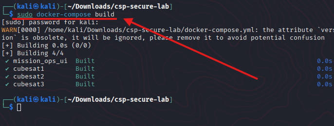

   ```bash
   sudo docker-compose up
   ```

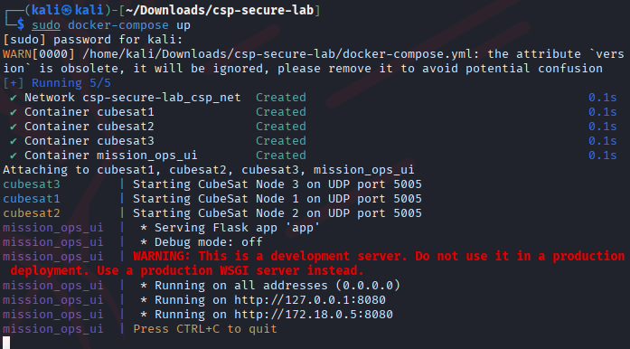

4. Open Mission Ops UI at `http://localhost:8080`.

### **Part 1 — Observe insecure beacons**

1. Open a terminal and tail logs for one CubeSat:

   ```bash
   docker logs -f cubesat1
   ```


   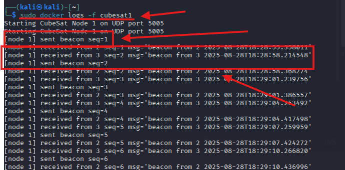

   Observe lines like `[node 1] sent beacon seq=1` and received beacons.
2. Open **Wireshark** on the host. Start a capture and apply the filter:

   ```
   udp.port == 5005
   ```

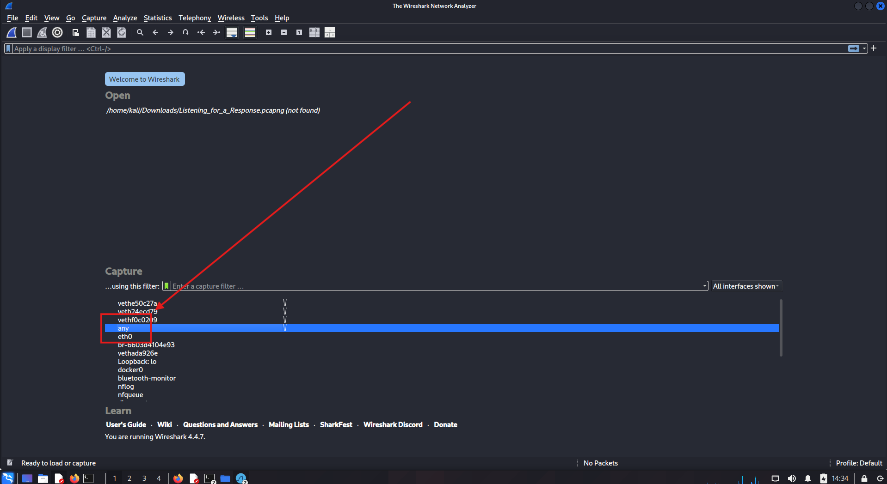

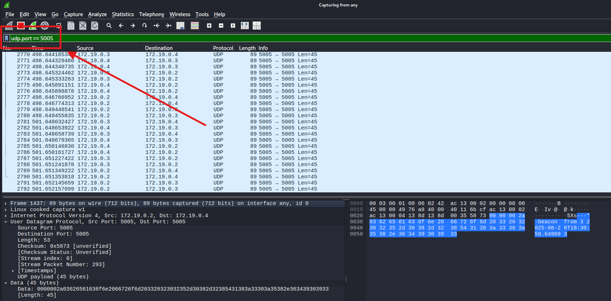

3. Inspect the packet bytes — because encryption is **disabled**, you should be able to see the UTF-8 text `beacon from ...` in the payload.


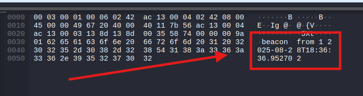

### **Part 2 — Enable XTEA encryption and sequence windows**

1. Stop the containers:

   ```bash
   sudo docker-compose down
   ```

2. Edit `docker-compose.yml`. For each cubesat service (cubesat1..3) add environment variables:

   ```yaml
   environment:
     - NODE_ID=1     # appropriate for each service
     - ENABLE_ENCRYPTION=true
     - XTEA_KEY_HEX=00112233445566778899aabbccddeeff
     - ENABLE_SEQUENCE_WINDOW=true
   ```

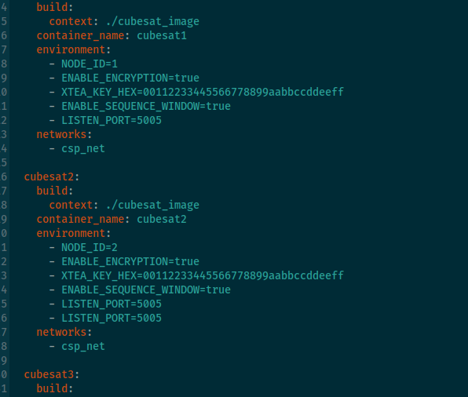

   (You can also pick a different hex key of length 32 hex chars — it's 128-bit.)

3. Start containers again:

   ```bash
   sudo docker-compose up --build -d
   ```

   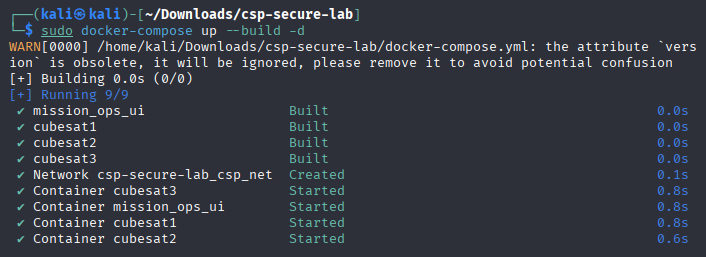

4. Watch logs: `docker logs -f cubesat1` — now each node prints sent beacons, and received packets will be parsed if decryptable.

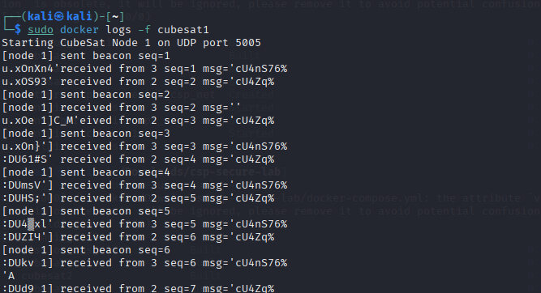

5. Use Wireshark filter `udp.port == 5005` and inspect the payload: now the textual message will **not** be visible (encrypted payload bytes).

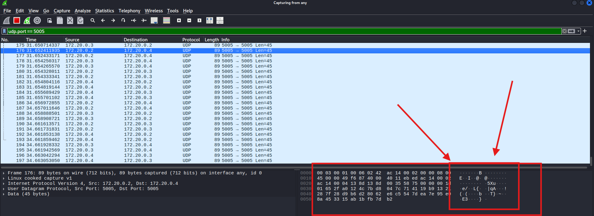

### **Part 3 — Rotate keys & test replay protection**

>[!IMPORTANT]
>
>THIS PART FOCUSES MORE ON RED TEAM AND IS STILL A LITTLE BIT BUGGED SO IT DOES NOT WORK PROPERLY. YOU CAN SKIP THIS PART.


>**Goal:** capture one beacon packet, rotate the symmetric key, replay the captured packet to a target node, and show the replay is dropped (either by failed decryption or by the sequence-window).

- The lab runs on a Docker network whose real name is prefixed by the compose project (ex: `csp-secure-lab_csp_net`). Use the `docker inspect` command below to get the exact network name and substitute it where shown.

1. Use the `scripts/capture_replay.py` to capture one plaintext/unencrypted beacon BEFORE key rotation (if you already enabled encryption, first revert to unencrypted, capture a packet, then re-enable encryption: this demonstrates the difference). For the lab flow we will capture an encrypted packet before rotation and attempt to replay it after.

   * Capture:

     ```bash
     sudo docker exec -it cubesat1 python3 /opt/csp/../scripts/capture_replay.py capture /tmp/beacon.bin
     ```

     (If `docker exec` path not available, run capture from host: `python3 scripts/capture_replay.py capture capture.bin`.)


>If that does not work, try the following method:

- **Find the Docker network name**:

```bash
sudo docker inspect -f '{{range $k,$v := .NetworkSettings.Networks}}{{$k}}{{end}}' cubesat1
```

>Example output: csp-secure-lab_csp_net
>
> Save that value; we'll call it <NET> below.

- **Capture a beacon** // recommended: ephemeral container on the same Docker network

```bash
# replace <NET> with the network name from the previous command
sudo docker run --rm --name capture-temp \
  --network <NET> --network-alias cubesat3 \
  -v "$(pwd)/scripts":/scripts -v "$(pwd)":/work -w /work \
  python:3.11-slim \
  python /scripts/capture_replay.py capture /work/captured_beacon.bin
```


2. Rotate keys:

   * Edit `docker-compose.yml` to set `XTEA_KEY_HEX` to a new value (different 32-hex chars), or run `scripts/rotate_keys.sh`.
   * Restart containers so they read the new key.

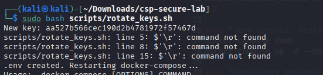

If you see something similar to the upper photo, run

```bash
sudo docker compose down
sudo docker compose up -d --build
```


3. Replay the captured packet to one node:

   ```bash
   python3 scripts/capture_replay.py replay /tmp/beacon.bin cubesat2 5005
   ```
4. Observe `docker logs -f cubesat2` — **expected**: the replayed packet should be **dropped** (either because decryption fails with the new key, or sequence-window rejects the older sequence number). The log will show a dropped message or a decryption/parsing failure.


---

**Interpretation:**

* If decryption fails (new key) the node logs "dropped non-parseable packet", which is good — old-key-encrypted packet cannot be decrypted.
* If decryption succeeds but sequence-window rejects (seq <= last), the node logs "dropped replay or old seq ...", which shows replay detection.

Either outcome is acceptable — the important part is the replay packet is **not** accepted as a valid message.

---


# 4)more personal notes ;)

**Why XTEA?** lightweight, suitable for embedded.

**Replay protection:** Sequence windows help detect replays but require careful sequence synchronization and recovery; consider using message authentication (MAC) or authenticated encryption (AES-GCM) for integrity/authentication.

**Key management:** In real satellites you need secure key distribution, rotation schedule, fail-safe for missed rotations, and possibly asymmetric bootstrap.

**Extensions:**

* Replace XTEA with AES-GCM using `cryptography` library to provide AEAD (authenticated encryption).
* Implement an out-of-band key distribution service (ex: signed key manifests).
* Add time-based nonces and authenticated headers.

---

# 5) Quick troubleshooting

* If `cubesatN` hostnames don't resolve inside containers: Docker network `csp_net` should handle DNS. If not, confirm containers are attached to same network: `docker network inspect csp_net`.
* If `jq` not found: the entrypoint script uses minimal JSON handling; our `csp_service.py` reads config and environment variables and overrides them — so ensure `NODE_ID` and other env vars are set in `docker-compose.yml`.
* If Wireshark captures from host show no traffic: ensure your Docker networking uses bridge and host can see it; alternatively, `docker exec -it cubesat1 tcpdump -U -n -w /tmp/cap.pcap udp port 5005` then `docker cp cubesat1:/tmp/cap.pcap .` and open pcap locally.

---

