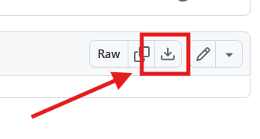

# Lab 1 — The Intercept (Red-Team Signal & Protocol Ops)

**Scenario**: Your team is hired to test the downlink resilience of a startup's CubeSat, **ODYSSEY-1**
They claim the link is secure. You're given two *historical* baseband captures from a ground station test

> Goal: Intercept → Decode → Reverse → (Simulated) Command

## Learning Outcomes
- Practice SDR recon on *synthetic* captures (recognize FSK, estimate bitrate)
- Recover frames using a CCSDS-like sync word and custom framing
- Parse telemetry, extract hidden intel, and derive a simple auth scheme
- Craft a valid **command packet** and feed it to a **local uplink gateway** (no RF) to receive the final flag

## What You Get
- `assets/pass_01.iq` — complex float32, 48 kS/s baseband (cleaner)
- `assets/pass_02.iq` — complex float32, 48 kS/s baseband (noisier)
- `tools/generate_captures.py` — deterministically regenerates the captures
- `tools/sat_gateway.py` — local validator for your crafted uplink packet
- `assets/*.json` — samplerate + format metadata

## Hints
- Symbol timing: a Mueller & Müller or Zero-Crossing clock recovery helps, but naive slicing works due to SNR
- CRC: CRC‑16‑CCITT (X^16 + X^12 + X^5 + 1) of `[VER|SEQ|TYPE|LEN|PAY]` (no sync)
- The second pass is noisier; improve your clock recovery or apply a matched filter

---

## Setup (Quick)
1. Install [GNU Radio](/Tools%20and%20Frameworks/GNU_radio.md) (>= 3.9)
```bash
sudo apt/dnf instal gnuradio
```

2. Download the zip for this main folder from [Here](./TheIntercepterLab.zip)

- Click the Download button




- Extract it

3. Optional: Regenerate captures
   ```bash
   python3 tools/generate_captures.py
   ```


