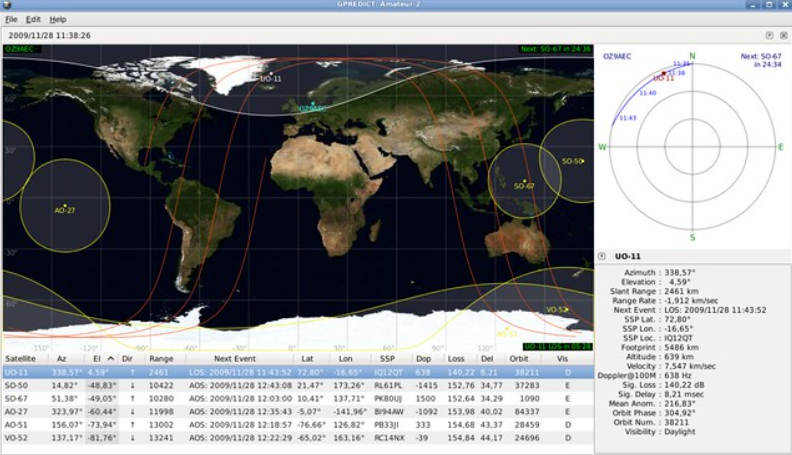

# Gpredict — Satellite Security

> **Tool:** Gpredict
>
> **Link (GitHub):** https://github.com/csete/gpredict
>
> **Homepage / docs:** https://oz9aec.dk/gpredict/
>
>  Gpredict is an open-source, real-time satellite tracking and orbit prediction application (GTK-based). It implements SGP4/SDP4 propagation using NORAD TLEs, predicts passes, computes azimuth/elevation and Doppler, and integrates with Hamlib to provide Doppler tuning and antenna rotator control. It is widely used in ground-station operations for scheduling, automated capture, Doppler correction and antenna pointing.

---

## Overview

Gpredict is a cornerstone for operational ground stations. It turns orbital data (TLEs) into actionable timings, pointing angles and Doppler corrections used by receivers, transceivers and antenna rotators. For satellite security this matters because:

- Ground-station timing & pointing decisions depend on accurate pass predictions and Doppler compensation. If these are wrong, receivers can lose lock or misinterpret data (a safety & availability risk).
- Gpredict is often the automation glue in small-to-medium ground installations: it triggers recordings, sends AOS/LOS events, and issues Doppler corrections to radios. Compromise or misconfiguration of Gpredict can therefore impact monitoring fidelity, evidence collection and response.
- The software is broadly deployed (Linux, macOS, Windows) and integrates with common stacks (GNU Radio, GQRX, Hamlib), so security teams must treat it as a mission-critical component with operational and supply-chain considerations.

---

## Key capabilities 

- **Real-time tracking:** SGP4/SDP4-based propagation; supports large satellite catalogs without practical limits.  
- **Pass prediction & scheduling:** computes AOS/LOS, maximum elevation, range, Doppler curve for each pass.  
- **Doppler tuning:** integrates with Hamlib rigctld to apply radio frequency corrections in real time during passes.  
- **Antenna control:** integrates with Hamlib rotctld to drive rotators (azimuth/elevation).  
- **Multiple ground stations:** you can configure many observer locations and switch between them.  
- **Simulated-time mode:** run fast-forward/replay of orbital scenarios for testing and training.  
- **Modular UI & headless usage patterns:** run visually for operations or embed in automated workflows (scripts, external wrappers that listen to Gpredict events).  

---

##  workflows

### 1) Hardened monitoring station setup (end-to-end)

1. Install Gpredict on a hardened host (minimal OS, automatic updates disabled for controlled patching).  
2. Configure a dedicated, local Hamlib instance for your radio: run `rigctld` bound to localhost or a VPN interface (example: `rigctld -m <model> -r /dev/ttyUSB0 -s 9600 -t 4532 -T 127.0.0.1`).  
3. Launch `rotctld` for the rotator on a different port and bind it similarly (example: `rotctld -m <rotor-model> -r /dev/ttyUSB1 -t 4533 -T 127.0.0.1`).  
4. Add the ground station and radio/rotator entries in Gpredict, set the observer’s coordinates and preferred TLE sources.  
5. Use a local TLE mirror (periodically fetched from CelesTrak/Space-Track) and verify checksums before import.  
6. Configure logging, audit trails, and signed archives for AOS/LOS events and Doppler commands sent to hamlib daemons.  

//but why this matters? -binding hamlib daemons to localhost or VPN, isolating Gpredict on a hardened host, and logging commands closes common attack surfaces (open TCP ports, exposed control daemons) and preserves provenance for later forensic analysis.

---

### 2) Automated capture pipeline (satellite security monitoring)

1. Use Gpredict to schedule passes and send AOS/LOS signals to an automation script or capture software (ex: GQRX, GNU Radio flowgraph, or SatNOGS station client).  
2. For Doppler-sensitive downlinks (LEO S-band, UHF), enable the Doppler tuning output to rigctld so the radio follows the predicted frequency.  
3. When a pass starts, have automation: set SDR bandwidth/mode, start IQ recording, tag the files with TLE epoch and pass metadata, and stream a parallel copy to an analysis server for near-real-time anomaly detection.  
4. On pass end, stop the recorder, compute checksums, and push the artifacts to the evidence store with signed metadata.  

Why this matters? - automated, reproducible captures reduce human error and provide consistent artifacts for later analysis and cross-correlation across stations.

---

### 3) Cross-station correlation to detect interference/spoofing

1. Configure multiple Gpredict instances or multiple ground stations in a single Gpredict instance (each with their own coordinates).  
2. Schedule simultaneous observations (or rely on volunteer stations via SatNOGS) and collect IQ/decoded telemetry streams.  
3. Compare received frequency offsets, SNR, arrival times and Doppler patterns across stations. Discrepancies (ex: identical signal power & zero Doppler at geographically separated sites) are red flags for spoofing or local repeaters.  

Why this matters? - Gpredict's consistent propagation model and pass metadata allow analysts to align datasets precisely and detect anomalies that single-station views would miss.

---

## Integration  & tips

- **Hamlib (rigctld / rotctld):** Gpredict uses Hamlib daemons for radio & rotator control. Run `rigctld` and `rotctld` as services with controlled ports (defaults: `4532` for rigctld, `4533` for rotctld). Prefer binding to `127.0.0.1` or a private management VLAN and use SSH tunnels/VPN for remote access.  

- **Doppler model tuning:** Gpredict computes Doppler based on predicted range-rate. For best results pair it with accurate TLEs  and keep your host clock synchronized (NTP or PTP). Offsets in system time directly translate to Doppler mismatch.  

- **TLE management:** configure an automated, signed TLE pipeline: fetch TLEs from authoritative sources (CelesTrak, Space-Track), check signatures/hashes you keep locally, and rotate them into Gpredict’s TLE directory. Avoid manual copy-paste of TLEs in production.  

- **Headless / automation hooks:** while Gpredict is GUI-first, you can automate workflows by monitoring its events (AOS/LOS/Doppler notifications) via local wrappers or by using Hamlib bindings that accept commands from custom scripts. Community projects provide glue scripts to translate Gpredict events to actions for GQRX, GNU Radio or other capture daemons.  

- **Simulated time & testing:** use Gpredict’s simulated-time feature to run replayed scenarios and validate your capture/analysis pipelines without waiting for real passes. This is invaluable for regression testing and incident drills.  

- **Geodetic & antenna models:** ensure the observer's lat/long/height are accurate; incorporate antenna offsets (feed offset, enclosure, pointing calibration) into Gpredict so commanded az/el values match physical reality.

---

## Security risks & abuse scenarios

- **Command injection / remote control exposure:** if `rigctld`/`rotctld` are bound to public interfaces or weak networks, attackers can remotely issue rotator or frequency commands, causing mis-pointing, intentional Doppler mis-tuning, or capture disruption.  
- **TLE poisoning / supply-chain risks:** automated TLE retrieval that lacks validation could be subverted to provide false orbital elements, causing mis-scheduling and incorrect Doppler—an attack vector to degrade monitoring.  
- **Log/metadata tampering:** if Gpredict host or automation scripts are compromised, attackers could alter logs or timestamps to hide deliberate interference or tampering.  
- **Denial-of-service via resource exhaustion:** massive subscription to TLE updates or scripted mass-scheduling could overload low-end Gpredict hosts (especially when running many concurrent modules).  

---

## Mitigation & operational 

- **Network hygiene:** bind hamlib daemons to loopback, use firewall rules to prevent direct internet exposure, and use VPN/SSH port forwarding for remote operator connections.  
- **Authenticate & isolate:** restrict who can edit Gpredict modules or ground station configs; use OS-level role separation and store critical automation scripts in version control with review processes.  
- **TLE provenance:** fetch from trusted sources (CelesTrak, Space-Track), store signed archives, and verify checksums prior to ingestion. Consider cross-checking multiple TLE sources and flagging large discrepancies.  
- **Time synchronization:** ensure NTP/PTP is secure and monitored; keep logs of clock adjustments. Use hardware PPS/1PPS when precise timing matters.  
- **Logging & forensics:** log all AOS/LOS events, Doppler commands and Hamlib interactions. Archive logs in an immutable evidence store with append-only permissions.  
- **Least privilege & process hardening:** run Gpredict and hamlib daemons under dedicated system users, limit file permissions, and run automated decoding/analysis in containers to reduce blast radius.  
- **Monitor for anomalies:** instrument Gpredict hosts and hamlib daemons with process monitoring and alert on restarts, unexpected port binds, or high-frequency scheduling changes.  

---

## troubleshooting & tips

- **Pass timing off?** Check your TLE freshness and system clock. If the TLE epoch is old or the system clock shifted, predicted AOS/LOS will drift.  
- **Doppler drift / mismatch?** Calibrate for SDR/transceiver oscillator offsets; use an external reference where possible and verify rigctld frequency units match expected units (Hz vs kHz vs normalized).  
- **Rotator not responding?** Verify `rotctld` is running, correct model and serial parameters are set, and that ports are open between Gpredict and rotctld. Use `telnet localhost 4533` to test connectivity and commands.  
- **Multiple stations / remote operation:** assign unique ports for each rigctld/rotctld instance (ex: 4532/4533, 14532/14533) and map them to their ground station entry in Gpredict.  

---

## more use cases 

- **Baseline & anomaly detection:** create baselines of expected Doppler/frequency/SNR vs pass geometry and trigger alerts when real-time observations deviate.  
- **Coordinated multi-site monitoring:** schedule simultaneous captures and compare cross-station frequency/TOA to pinpoint interferers.  
- **Incident replay / training:** simulate hostile TLE or spoofing scenarios in a testbed using simulated-time mode and record how your automation responds.  
- **Operational audits:** verify that antenna pointing and Doppler compensation have been applied consistently across critical passes and that automation behaves to policy (ex: never transmit during unauthorized windows).  

---

## integrations

- **Programmatic TLE pipelines:** automate TLE fetch (CelesTrak or Space-Track API), validate one-way hashes, and atomically swap TLE files in Gpredict’s TLE directory.  
- **Custom event hooks:** use wrapper scripts that listen for Gpredict AOS/LOS messages (or poll the predict result) and trigger complex workflows (start distributed recorders, spin up analysis containers, send alerts).  
- **Integration with SatNOGS / gr-satellites / GNU Radio:** use Gpredict for scheduling and Doppler, then hand off captured IQ to gr-satellites or custom GNURadio decoders for telemetry analysis.  
- **Hardware-in-the-loop & rotator calibration:** couple Gpredict output with a ground-station test harness to measure real-world pointing errors and maintain a calibration database.  

---

## Practical resources & links

- Gpredict GitHub: https://github.com/csete/gpredict  
- Gpredict homepage & download: https://oz9aec.dk/gpredict/  
- Gpredict user manual (PDF): https://sourceforge.net/projects/gpredict/files/Gpredict/2.2.1/gpredict-user-manual-2.2.pdf/download  
- Hamlib rigctld/rotctld docs & manpages: https://hamlib.sourceforge.net and `man rigctld` / `man rotctld` (default ports 4532/4533)  
- CelesTrak (TLE sources & feeds): https://celestrak.org  
- Space-Track (authenticated TLE API): https://www.space-track.org  
- SGP4 / propagation libraries (Python): https://pypi.org/project/sgp4/  
- Example integrations & community guides: Libre Space Community (Gpredict channel) — https://community.libre.space/c/gpredict  

---
